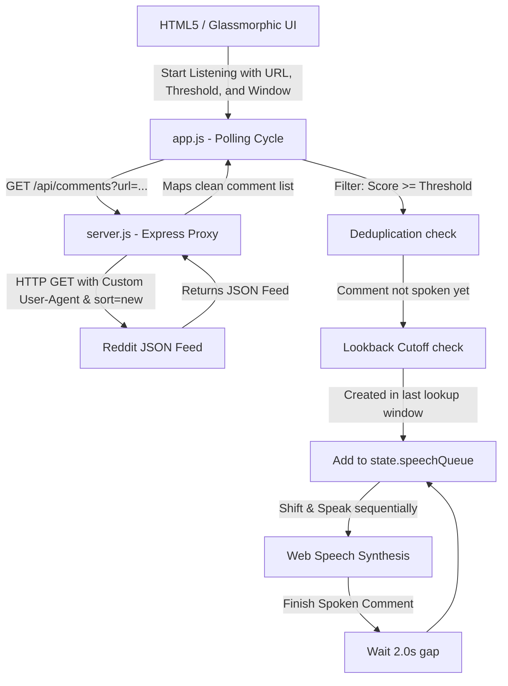

# 🎙️ Reddit Whisper - Live Match Thread Soundcaster

Reddit Whisper is a premium, real-time comment scraper and Text-To-Speech (TTS) audio broadcaster designed specifically for following highly active Reddit threads—such as live cricket match threads—without needing to constantly look at your screen. 

The application monitors any public Reddit thread, identifies high-quality comments that cross a customizable upvote threshold ("N" upvotes), cleans them for smooth spoken delivery, and speaks them aloud using system-native voices (auto-selecting the premium Indian English **Rishi** voice when available).

---

## ✨ Features

- **No Reddit Developer Credentials Required**: Leverages a local lightweight Express proxy to fetch the public `.json` endpoint of Reddit threads using a specialized, rate-limit-resistant `User-Agent`. Completely bypasses CORS blocks out-of-the-box.
- **Clock-Drift Resistant Time Filtering**: Rather than using your computer's clock (which can drift and lead to missed comments), the scanner uses the timestamp of the *newest comment in the batch* as a live reference time. Old match threads from hours or days ago can also be pasted and tested seamlessly!
- **Paced Speech Queue**: Replaces rushed back-to-back browser speech delivery with a custom managed speech queue that introduces a pleasant, natural **2.0-second delay gap** between comments.
- **Premium Voice Auto-Selection**: Scans available local system voices on first load and automatically configures the high-quality **"Rishi" (en-IN)** voice as the default choice. 
- **Stunning Glassmorphic Interface**: Fully designed in cyberpunk dark mode featuring frosted cards, glowing upvote badges (color-coded by popularity), real-time polling timers, dynamic status indicators, and an interactive CSS soundwave visualization.
- **Deduplication Safeguards**: Tracks spoken comment IDs in memory to ensure no comment is ever spoken twice.
- **Instant Audio Replay**: Simply click the "Replay Audio" button on any timeline comment card to hear it again instantly.

---

## 📐 Architecture & Flow



---

## 🛠️ Technology Stack

- **Backend**: Node.js, Express.js, CORS, ESM (`import/export`)
- **Frontend**: Semantic HTML5, CSS Variables, Vanilla CSS layout system
- **Audio Engine**: Native Web Speech API (`window.speechSynthesis`)

---

## 🚀 Quick Start Guide

### 1. Installation
Clone the repository and install the dependencies:
```bash
git clone <your-repo-url>
cd reddit_whisper
npm install
```

### 2. Launch the Application
Run the local server using standard npm scripts:
```bash
npm start
```
This starts the Node backend at [http://localhost:3000](http://localhost:3000) and **automatically pops open** the web application in your default browser!

### 3. Setup your Soundcaster
1. **Thread Setup**: Copy the URL of any active Reddit thread (such as `/r/Cricket` match threads) and click the **Paste (📋)** icon.
2. **Set Threshold (N)**: Adjust the upvote threshold slider. For fast match threads, `10` or `15` upvotes is recommended. For slower threads, reduce it to `1` or `2` upvotes.
3. **Lookup Window**: Adjust the sliding lookback window (e.g. `300s` / 5 minutes). At every refresh cycle, the scraper will look back this far for popular comments, giving fresh posts enough time to accumulate upvotes!
4. **Choose Voice**: Test the voices and speeds by clicking **Test Voice Settings**.
5. **Start Listening**: Click the glowing **Start Listening** button. The system status will turn green, and the soundwave will begin to pulse as comments speak!

---

## 📂 File Layout

```text
reddit_whisper/
├── package.json         # Metadata, scripts, and dependencies (express, cors, open)
├── server.js            # Node/Express server acting as a CORS bypass proxy
├── .gitignore           # Excludes node_modules and OS-specific files
├── README.md            # Comprehensive project documentation
└── public/              # Static frontend assets
    ├── index.html       # UI structures, Google Font hooks, and control panels
    ├── style.css        # Rich Glassmorphic styling and keyframe animations
    └── app.js           # Polling intervals, speech queues, and clean TTS filters
```

---

## 🔒 Security & Privacy

This application is **100% serverless on the cloud** and operates purely on your local machine.
- No Reddit accounts or OAuth client secrets are used.
- Zero tracking scripts or third-party analytics are embedded.
- No Personal Identifiable Information (PII) or developer secrets are hardcoded anywhere in the codebase.
